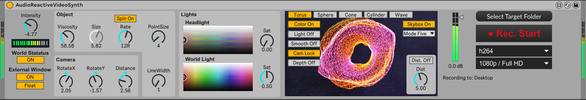

# WARNING

Using this M4L device on Ableton Live 11 using the embedded Max8 Version (8.5.6) will probaly crash you Ableton. Also, the Skybox Feature will not work here.
Upadte Max to use this device! This device was developed and tested using Ableton Live 11 and Max8 8.6.2.

This M4L device is heavy! It may eat a lot of cpu, it uses GPU. This is especialy so if you use it for the 1st time. It is probably not posible to have it running in an already cpu expensive live set. 

## My System

Deleopment and testing is done using Windows 11, Ableton 11 Suite (latest update), Max8 (latest update), Ableton is configured to NOT use the bundled Max version (Ableton Preference, Folders).
- AMd Ryzen 7 5700 8 Core CPU
- 32 GB
- Geforce RTX 3060
- 32 GB Memory

# DESCRIPTION:

AudioReactiveVideoSynth was originally created by supertramp162 and published on maxforlife.com.

Link to supertramp162
- MaxforLive: https://maxforlive.com/profile/user/Supertramp162
- YouTube: https://www.youtube.com/@Supertramp162

# Download M4L device

[AudioReactiveVideoSynth](https://github.com/th-m-vogel/Max-Patches/raw/main/M4L-Devices/AudioReactiveVideoSynth/AudioReactiveVideoSynth.amxd "Download")

# Custome Skyboxes

You can drop a Cubemap on the VCR preview in the device. For Space cubemaps you may want to visit - https://tools.wwwtyro.net/space-3d/index.html - the skybox included with the plugin is a 1k skybox from tyro. 1st release version included 2k skyboxes - that's somewhat heavy. Keep in mind, a 1k skybox is already a 4k by 3k png file.

# ACTUAL STATE

Tracks created with this device: 
- Version 0.5 - https://youtu.be/GW951CoEjf4
- Latest update - https://youtu.be/m0fzrX3LgxI

2nd release update
- there is now only one skybox included, however, you can apply your own skybox by dropping a cubemap on the VCR preview. For cubmap files see also the cubmap folder here. 
- skybox is deisabled by defailt to make the plugin a bit less demanding by default.

2nd release
- Mous over Help for all UI elements (at least think that i added this for all ... )
- An additional object to chose from (Wave, just to play with jit.gen)
- Many more options to customize the objects rendering and camera control.
- you can use a custome skybox. Just drop the skybox file (cross shape cubemap) on the video preview in the plugin.

1st relaese: 
- added direct recording function
- some internal rework, got some understanding of the internal working
- new UI
- added a skybox

# NEXT STEPS

~~- Understand what was done and use it to develop furter from here ... we will see.~~
~~- Use custome Cubemap by dropping file on Plugin~~
- improve on animation ... ongoing
- improve on video effects ... after a 1.0 version.

# Remarks

Enjoy ... make music ... Use at your own risk ... 

