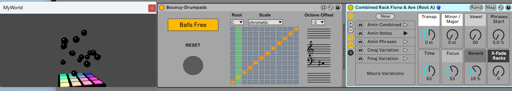

# DESCRIPTION:

The grid is a lie and gravity in Max physics is chaotic ... To be honest, i just wanted to play around and learn a bit about Max physics. So there we go. Don't know to where this will go ...

# Download M4L device

[Bouncy-Drumpads](https://github.com/th-m-vogel/Max-Patches/raw/main/M4L-Devices/Bouncy-Drumpads/Bouncy-Drumpads.amxd "Download")

# ACTUAL STATE

~~The pads are sometimes sticky and do not trigger, just like in the real world ... ads some extra randomnes, call it intended.~~
The Pads are now working fine, i found an issue in Max8 collision detextion and also a fix.

Some graphics rework, light effects and rounded edges. ... IMHO looks better.

You can now run multiple instances of this plugin in your session. May make the UI slow. Ableton dows not like M4L devices using Max jit.gl ... or maybe Max jit.gl does not like to run inside Ableton ... I don't know.

Oh, you asking about tis "External VCR" thingy thing? That's preperation for someting upcomming.

https://youtu.be/XBGGrbZab48

https://youtu.be/1vF5K1ClU_E 

# Remarks

Enjoy ... make music ... Use at your own risk ... 

