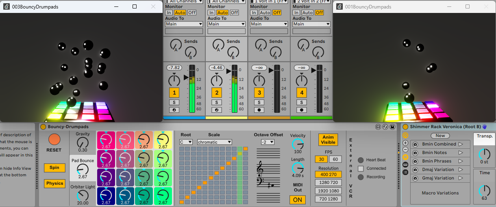

# DESCRIPTION:

The grid is a lie and gravity in Max physics is chaotic ... To be honest, i just wanted to play around and learn a bit about Max physics. So there we go. Don't know to where this will go ...

# Download M4L device

[Bouncy-Drumpads](https://github.com/th-m-vogel/Max-Patches/raw/main/M4L-Devices/Bouncy-Drumpads/Bouncy-Drumpads.amxd "Download")

# ACTUAL STATE

I call this Version 1.0

A Physics Based MIDI Generator. Did you ever thought “What would happen if I could bounce balls on my 4 x 4 pad section of my MIDI controller?” … Well, there it is. And as it is a simulation …

-	You can adjust Gravity.
-	You can adjust the bounciness of the pads to unnatural high levels.
-	Simulated physics is a bit glitchy, so there is some randomness.

You can run multiple instances in different track of your Ableton Live Set
For the external window, obviously you can resize it. And you have buttons in the plugin for specific sizes and framerate. To conserve system resources keep it small and low res. 

-	Pressing Esc-Key in the external window will make it full screen.
-	When “Spin” is witched off, you can control the camera using “W A S D Q Z”.

Full HD at 60 Hz may have noticeable effects on the UI interactions with you Ableton Live! This is a know issue with M4L using 3D graphics.

### What is this “External VCR” thing?
In parallel I work on an AV recording plugin you can place in your master track to record graphics from visualization plugins. I make it now available as a BETA!!
- it works
- the UI is rougth ...
- The in device preview will disapear when changing to another track and back however it will still work ... in most cases
- it is available in two flavors

Modular-Spout-Sender - ../Modular-Spout-Sender/

Modular-AV-Recorder - ../Modular-AV-Recorder/

# Showcase

https://youtu.be/XBGGrbZab48

https://youtu.be/1vF5K1ClU_E 

# Remarks

Enjoy ... make music ... Use at your own risk ... 

