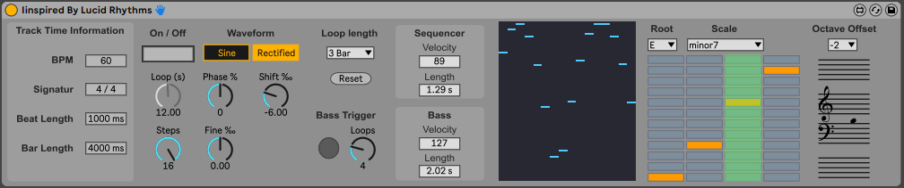

# DESCRIPTION:

Something polyrhythmic, semi generative - ish ... sequencing ... You have 16 (or less) running on different phase and phase shift to create notes from a defined scale.

The 16 tracks running with increasing phase shift, playing notes inceasing from left (1st stage) to right. The notes ar played acording to selected root and scale.

the bass hit is repeated after a defined number of cycles. The bass play always at root note two octaves below the 1st stage, what is the root note selected. You may want to use an instrument rack to route the bass to a different instrument than the main sequence.

The device linked to Ableton Transport. Transport off stops the device fcrom running.

In fact, i wanted to do something in the direction of the YT-er Lucid Rythm and took this as a reason to dip in to Max ... So, my 1st M4L device.

want to have a look at it running? - https://youtu.be/H_1-QaDhjWg

M4L Device is also available at Maxforlife.com - https://maxforlive.com/profile/user/Sevetamryn - however, updates here may be more frequently. Also, the project folder my update more often than the M4L device.

# Download M4L device

[Iinspired By Lucid Rhythms](<https://github.com/th-m-vogel/Max-Patches/raw/main/M4L-Devices/Iinspired By Lucid Rhythms/Iinspired By Lucid Rhythms.amxd> "Download")

# UI Description

- On/Off switch: You can Start/Stop the device. When ON the Phase setings are locked.
- Sine / Rectified: changes Waveform for the oscilation from Sine to Full-Rectified-Sine. Will Result in different pattens, especialy over longer running time.
- Loop Length:cycle time per stage. When set to "free" the Loop Time dial "Loop (s)" gets unlocked
- Loop (s): cycle time per stage. only unlocked if Loop Length is set to "free"
- Phase: adusts the initial phase shift from stage to stage in %
- Fine: Fine adusts the initial phase shift from stage to stage in ‰
- Shift: Adjists the phase shift per stage, per cycle in ‰
- Steps: how many of the available 16 steps are active
- Reset: resets stages
- Bass Trigger Button: shows bass Trigger, can trigger bass manually
- Bass Trigger Loops: after how many cycles the bass will trigger
- Sequencer and Bass Box: Set Velocity and Note Lengt as desired

- The Multislider Box: Visualizes the state of the changes. ToDo - make this an  workin input device for the initial state. 

- Root: root note for the sequence
- Scale: scale to use for the sequence. If you select random / permute / neighbour thr <"Trig" button will scramble the Matrix
- Matrix: Visualisation of the scale to use. You can change this.
- Octave Offset: in waht octave is the lowest note (leftmost cycle) played

- Visualisatio: well, just what is is ...

# ToDo

Fix identified quirks, find more and fix, Improve, learn more about Max.
- ~~enable multi instancig~~
- rework internal message flow for more convinient expansion
- at chord / appegiator mode persequencer step
- add info text for all plugin conmtrols

# Remarks

Enjoy ... make music ... Use at your own risk ... 

