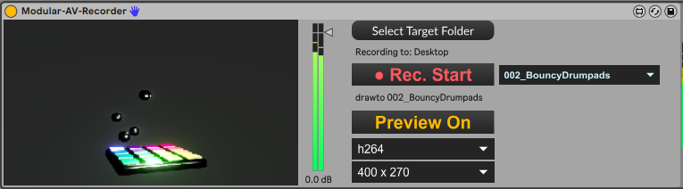

# DESCRIPTION:

** BETA **

This device is designed to auto discover video M4L devices available in the Ableton set. Auto discover is based on a properitary protocoll, however everything is open source, see also below the section regarding the Abstraction needed to enable existing Video patchers to be discovered and connected. 

** Attention **
This devive is very hungry for Ressources and may (on high resolution) render your Ableton in a state where you can't interact with the user interface. For this reason i created a Spout version from this device, also available here ../Modular-Spout-Sender/ 
I HIGHLY recoomend, if you are familiar (or want to become familiar) with Spout, use the Modular-Spout-Sender! 

Basic functions:
- Select Target Folder - self descriptive i think ;) ... Default target is "Desktop".
- "Rec Start" locks the source select menu, switches the source to the desired resolution and starts recording.
- The drop down menu is used to select from the available sources.
- Switching it off - Rec stop - stops recording, switches the resolution back and unlocks the source select menu.
- The info text shows what source is selected.
- The selected source is visible when Preview on. 
- The codec menu selects video codec for recording.
- The resolution menu selects the resulution to set when the recording is active.

Known issues:
- see above - super ressource hungry
- when you go to a different track and come back to the track where the device resides, the preview will probably be black and stay this way. However, it is still in working conditions. You still can change sources. What is neasy to check using your spout resceiver.
- deleting the device while a source plugin is connected mwill probably effect the source plugins graphic presentation.

# Download M4L device

[Modular-AV-Recorder](https://github.com/th-m-vogel/Max-Patches/raw/main/M4L-Devices/Modular-AV-Recorder/Modular-AV-Recorder.amxd "Download")

# ACTUAL STATE

It is an early stage development

- It is working for me
- integration in existing M4L devices is easy, just a little abstraction needs to be added
- My Bouncy-Drumpads device is already prepared to communicate with the Spout Sender

# Abstraction for your exiting Visualisations

https://github.com/th-m-vogel/Max-Abstractions/blob/main/sev.VideoSender.maxpat

It is meant to be used as a bpatcher
Documentation needs to be done.

# Remarks

Enjoy ... make music ... Use at your own risk ... 

