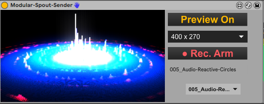

# DESCRIPTION:

** BETA **

This device is designed to auto discover video M4L devices available in the Ableton set. Auto discover is based on a properitary protocoll, however everything is open source, see also below the section regarding the Abstraction needed to enable existing Video patchers to be discovered and connected. 

This Spout-Sender is a side product of the (also mavailable her) Modular-AV-Recorder and uses the same protokoll. It was just low hanging fruit to make a Spout version from the recorder version. Also, the spout version needs considderable less ressources.

Basic functions:
- The selected source is visible when Preview in ON
- The resolution menu selects the resulution to set when "Rec Arm" is used
- "Rec Arm" locks the source select menu und switches the source to the desired resolution
- Switching it off - Rec disarm - switches the resolution back and unlocks the source select menu
- The info text shows what source is selected
- The drop down menu is used to select from the available sources

It is just a spout sender and i asume at this point in time that you have spout and know how to use it.

Known issues:
- when you go to a different track and come back to the track where the device resides, the preview will probably be black and stay this way. However, it is still in working conditions. You still can change sources. What is neasy to check using your spout resceiver.
- deleting the device while a source plugin is connected mwill probably effect the source plugins graphic presentation.

# Download M4L device

[Bouncy-Drumpads](https://github.com/th-m-vogel/Max-Patches/raw/main/M4L-Devices/Modular-Spout-Sender/Modular-Spout-Sender.amxd "Download")

# ACTUAL STATE

It is an early stage development

- It is working for me
- integration in existing M4L devices is easy, just a little abstraction needs to be added
- My Bouncy-Drumpads device is already prepared to communicate with the Spout Sender

# Abstraction for your exiting Visualisations

https://github.com/th-m-vogel/Max-Abstractions/blob/main/sev.VideoSender.maxpat

It is meant to be used as a bpatcher
Documentation needs to be done.

# Remarks

Enjoy ... make music ... Use at your own risk ... 

